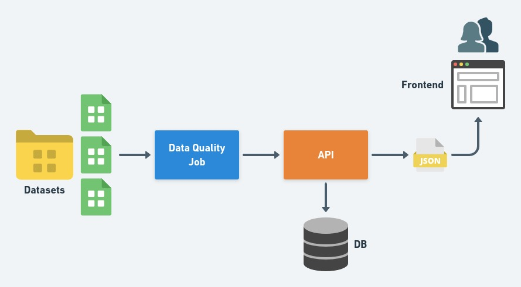

# Data Discovery

Data Discovery project in partnership with the CiDAMO-UFPR group.
## Objective

Build an application that summarize a dataset, showing basic statistics (for e.g. max, min and percentage of missing values), histograms, correlations, data quality report, and other relevant metrics.

## Architecture overview

The following diagram shows the overall architecture for the project.

The project is composed by:
- a Data Quality Job package written in Python responsible for getting a summary of Datasets;
- a MongoDB Atlas used as persistence to store Datasets' metrics;
- a API developed using FastAPI, a Python web framework;
- a frontend built with ReactJS to show all the metadata extracted from Datasets. 



## Data

This project is based on a Brazilian ecommerce public dataset of orders made at Olist Store. It is available on [Kaggle](https://www.kaggle.com/olistbr/brazilian-ecommerce).

## Dependencies

Docker version 20.10.8 \
Docker-compose version 1.29.2 \
FastAPI version 0.68.0 \
Uvicorn version 0.15.0 \
Motor version 2.5.1 

To check a complete list of project's dependencies check requirements.txt

## Installation

1. Clone dev branch locally ```git clone -b develop https://github.com/americanas-data-platform/data-discovery-cidamo.git```
2. Check if there is any process running on TCP 80
3. We are using docker to package and deliver the source code, so in order to launch a local server you must use ``` docker-compose up --build```
4. Create a .env file at api/ containing the following database environment variables:
       

    MONGO_INITDB_ROOT_USERNAME=root
    MONGO_INITDB_ROOT_PASSWORD=example 
    MONGO_INITDB_PORT=27017

In our case, the secrets have already been shared in the [compose-file](docker-compose.yml) but on production environments
you must use some secrets management tool like [AWS Secrets Manager](https://aws.amazon.com/pt/secrets-manager/), 
[Google Secret Manager](https://cloud.google.com/secret-manager) or any other solution that helps you to cast this variables
in runtime.


To use and use test scripts like those described in data_quality/scripts, go to the root of the project and call ```python -m data_quality.scripts.{SCRIPT_NAME}``` like ```python -m data_quality.scripts.local_csv```

## License

[MIT License.](./LICENSE)
