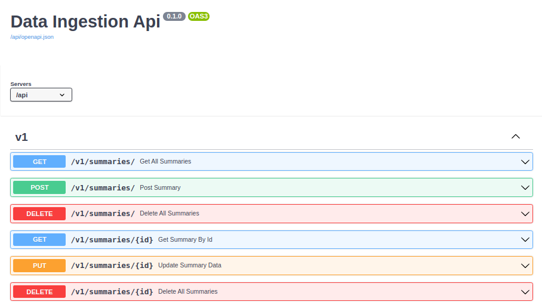

## Primeiros passos 
Caso tenha executado o comando `docker-compose up --build` como indicado no README da raiz do projeto, você terá uma 
versão de documentação auto-gerada e interativa em [http://localhost/api/docs](http://localhost/api/docs)