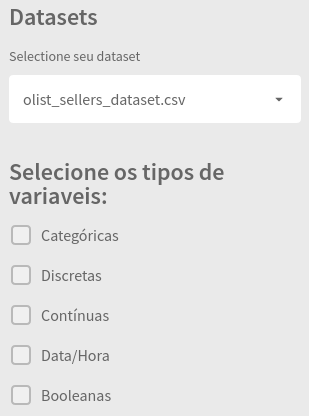
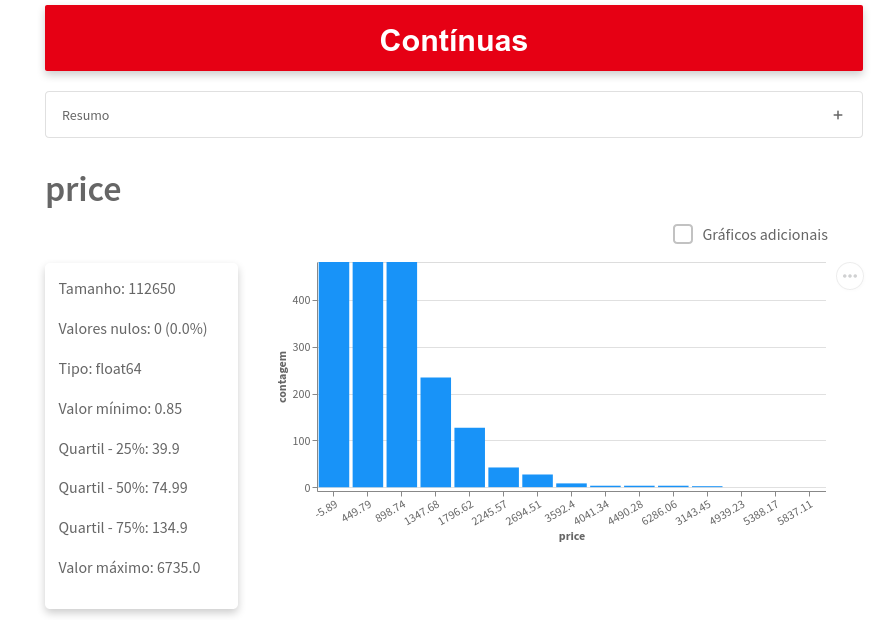
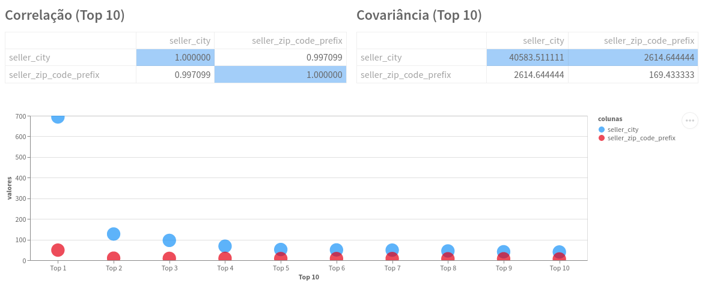

## Dependencies

pandas version 1.3.1 \
altair version 4.1.0 \
streamlit version 0.89.0 \
requests version 2.26.0

To check a complete list of project's dependencies check requirements.txt

To run exclusive this frontend when the backend is already running (check the previous repository), just run `streamlit run main.py` 

<h3>Data Quality</h3>

Data Quality is the essence of this work. Clicking on the sidebar, you can select a dataset to be analyzed from the list of avaliable datasets. After the selection, you can just select the type of variables you want to analyze on the screen:

Once the dataset and the type of variable was selected, on the screen you can se the statistics of the this variables.

Right bellow the title with the type of the variable, you can see a table with a summary of all the variables of this type in the dataset. Then, the statistics of each variable are presented in detail.

Regardless of the type of variable, the *size* of the dataset (number of lines), the *type* of the variable within the application and the number of *null values* will always be displayed. Regarding the graphs, the top 10 most frequent values ​​will be shown. To view the 10 least frequent values, click on the *Additional Charts* option in the upper right corner of the chart.

For each type of variable, different statistical measures are reported. In the case of continuous variables or datatime variables, the quartile, the maximum and minumum values are displayed.

The graph beside the statistical measures is interactive, you can use the scroll to zoom in different regions of the graph. In addition, it is possible to click, drag and leave the mouse on top, giving a more specific description of the value assigned to the column.

Note also that there is a check for 'Additional Graphics', and by checking it other graphics are presented in relation to this variable.

<h3>Comparações</h3>

The comparison session aims to observe the information of two different variables simultaneously, being both from the same dataset or from two different ones.

When selecting this section, in the sidebar, two selector boxes are available for choosing the datasets. Once these have been chosen, another two selector boxes are available on screen for the selection of the respective variables of the datasets previously selected.

Having chosen the variables for each dataset, the complete information about them is shown (as was done in Data Quality in the previous session) as well as some simple information of crossings between the top 10 values ​​of the two variables.

Then, we have the correlation and covariance tables between the two selected variables, and also a graph that displays the simultaneous count of the 10 most frequent values.

<h3>Sobre</h3>

Finaly, on the last section, its possible to know more about CiDAMO and the group members who were involved in this project.

Navigating this session and connecting with project owners on Linkedin is part of the Data Discovery experience! ;)

